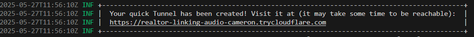

## This Project is called **Spotify Playlists**

Kindly check the project here → <a href="https://yasserdalal.github.io/Spotify_Playlists/" target="_blank">**Spotify Playlists**</a>

This project is built with React.js  and Tailwind CSS 

Developed a clean and responsive UI using warm colors to provide a comfortable experience for users.

## Please Read Me First

I'm sorry, **you can't** use the **full features** of this **Project**, cause this **Project** is in **Development Mode**, the reason for that is Spotify doesn't want to accept an application to be in **Production Mode** that has less than **250,000 users**. <br><br>No worries we can work this around, 
<br><br> Send me your ```email account``` to your Spotify
<br><br> &nbsp;&nbsp;Go to my contacts Here are the links → <a href="https://www.facebook.com/yasser.dalal.7">Facebook</a> • <a href="https://www.instagram.com/yassuuee/?hl=en">Instagram</a> • <a href="https://mail.google.com/mail/u/1/#inbox?compose=DmwnWrRmTpDrsTzhDsMqNXdbkfkfgcxqZwQKprRrFVSrsLRkntnQRcZgPxJFvzBDxcdswxkFLPjb">Gmail</a>
<br><br> I will respond to your message immediately

## For development access

#### Step 1:
### &nbsp;&nbsp;&nbsp;&nbsp;Go to Cloudflare Github → <a href="https://github.com/cloudflare/cloudflared/releases">Cloudflare</a>
#### Step 2:
### &nbsp;&nbsp;&nbsp;&nbsp;Scroll Down to find ```Assets``` tab
#### Step 3: 
### &nbsp;&nbsp;&nbsp;&nbsp;Click the latest release of ```.pkg```
#### Step 4:
### &nbsp;&nbsp;&nbsp;&nbsp;After downloading it, Rename the file to ```cloudflared.exe```
#### Step 5:
### &nbsp;&nbsp;&nbsp;&nbsp;In your **File Explorer** Move the ```cloudflared.exe``` to ```C:\```
#### Step 6: 
### &nbsp;&nbsp;&nbsp;&nbsp;Go to your VS Code ( make sure you have ```Git Bash``` or ```Bash``` installed )
#### Step 7: 
### &nbsp;&nbsp;&nbsp;&nbsp;In your ```Bash``` terminal type ```npm run dev```
#### Step 8:
### &nbsp;&nbsp;&nbsp;&nbsp;Copy the ```http://localHost:3000``` or any **number/pathname** at the end of the URL  
#### Step 9: 
### &nbsp;&nbsp;&nbsp;&nbsp;Create another ```Bash``` terminal tab 
#### Step 10:
### &nbsp;&nbsp;&nbsp;&nbsp;Copy this command ```./cloudflared.exe tunnel --url http://localhost:3000 --no-chunked-encoding``` change the ```http://localhost:3000``` with the one that you copy earlier then hit **Enter**
#### Step 11: 
### &nbsp;&nbsp;&nbsp;&nbsp;You will see something like this in your terminal

### &nbsp;&nbsp;&nbsp;&nbsp;Copy the URL below the message and Paste it in a browser
<br>
<br>

## Here are the technologies I used for this project

&nbsp;&nbsp;&nbsp;&nbsp;&nbsp;&nbsp;&nbsp;&nbsp;&nbsp;&nbsp;&nbsp;&nbsp;&nbsp;&nbsp;&nbsp;&nbsp;&nbsp;&nbsp;&nbsp;&nbsp;
&nbsp;&nbsp;&nbsp;&nbsp;&nbsp;&nbsp;&nbsp;&nbsp;&nbsp;&nbsp;&nbsp;&nbsp;&nbsp;&nbsp;&nbsp;&nbsp;&nbsp;&nbsp;&nbsp;&nbsp;&nbsp;&nbsp;&nbsp;&nbsp;&nbsp;&nbsp;


## &nbsp;&nbsp;React&nbsp; | &nbsp;&nbsp;Javascript&nbsp; | &nbsp;&nbsp;Tailwind CSS

